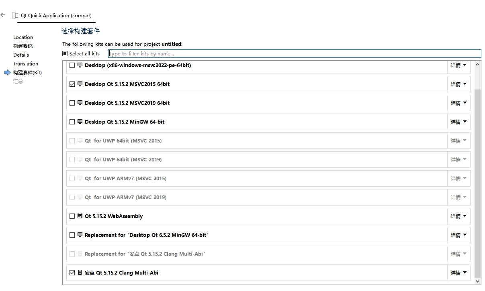
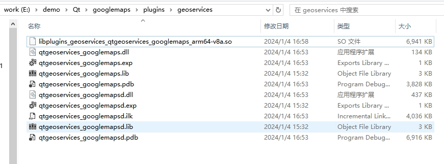
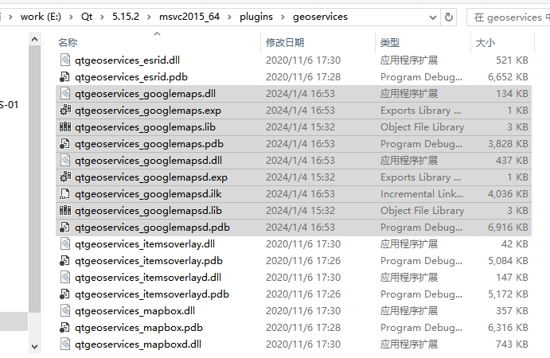
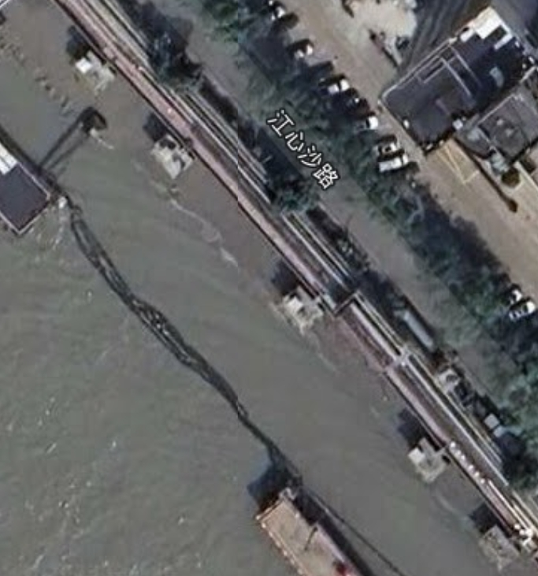

# Google China Maps plugin for QtLocation
#### 谷歌地图Qt插件

- Qt地图插件，使用简单方便，不用浏览器内核，运行高效迅猛
- 跨平台支持（这些是实际使用过之后确定可以使用的）
  - Windows （MSVC、MinGW）
  - Android （arm64-v8a）

#### 编译工程

> 该插件适用于Qt5

1. 克隆工程

   ```shell
   git clone https://github.com/CNPolaris/qt_googlemaps.git
   ```

2. 编译工程

   双击.pro文件会在QtCreator中打开，然后选择编译平台

   
   
   编译器加载所需环境后，开始构建插件
   

  	

3. 拷贝插件

   以上编译结束后会在编译输出路径下出现plugins\geoservices目录,将生成的dll文件拷贝到所使用的编译环境下的插件目录

	
	
	如我使用的是msvc2015 64编译，就拷贝到如下文件夹
	

#### 示例

```js
import QtQuick 2.12
import QtQuick.Window 2.12
import QtPositioning 5.12
import QtLocation 5.12

Window {
    visible: true
    width: 640
    height: 480
    title: qsTr("Hello AMap")

    Map{
        anchors.fill:parent
        plugin: Plugin{
            name: "amap"
        }
    }
    Component.onCompleted: {
        for (var i = 0; i < map.supportedMapTypes.length; i++) {
            console.log(map.supportedMapTypes[i].name)
            if (map.supportedMapTypes[i].name === "Hybrid") {
                map.activeMapType = map.supportedMapTypes[i] //设置到当前类型
                break
            }
        }
    }
}
```



#### 拓展

其他的功能就看着官方文档就好了